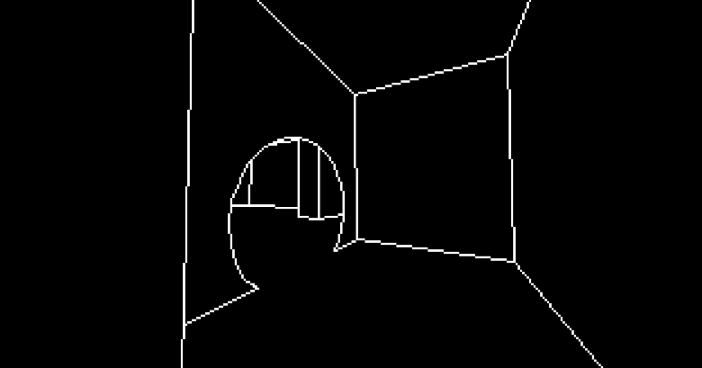

## What even is this?!

It started as a small experiment with me trying to display something purely with WINAPI. Once I managed to do it, I just kept going. At this point, what we have here is some kind of a 3D game engine where you can walk around a wireframe version of the level Triple Laser from Portal 2, even with functional portals! (only visually lol).

## Goals

The goal is to have a fully-functional replica of test chamber Triple Laser from Portal 2, contained in a relatively small executable size, with no additional dependencies apart from the Windows API, with a potential ability to port onto some retro/home-made devices. In order to minimize the size, the game's style would heavily rely on simple lines, sort of like in [Vib-Ribbon](https://en.wikipedia.org/wiki/Vib-Ribbon).

## Contributing

Contribute any way you'd like! It is around the time that I've lost all motivation to this side project, and even the smallest contribution could help me get back to it! Small typo, complete refactor of the project, or maybe you just want it to be in goddamn zig - do whatever you want - as long as it's better than the original, I'll pull it in lol.